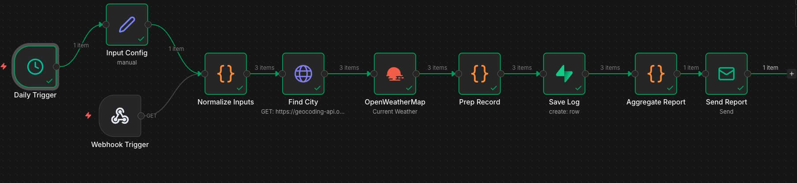
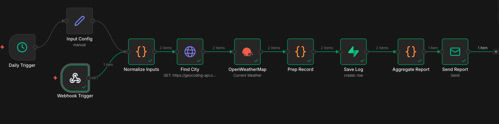

# Daily Weather Automation (n8n + OpenWeatherMap + Supabase + Email)

This workflow fetches daily weather for one or more cities, detects basic alerts (rain/heat/frost),
logs results to Supabase, and emails a daily summary.

## 📝 What it does

1. Accepts inputs (Daily Trigger default OR Webhook query params)
2. Resolves city -> weather data
3. Builds formatted summary + alert type
4. Inserts each city result into Supabase (`weather_logs`)
5. Aggregates results (same day) and sends ONE email to the recipient

---

## 🌍 API Setup & Key Config

### OpenWeatherMap

- Create an API key
- Used by the [`OpenWeatherMap`](https://openweathermap.org/) node (Current Weather)

---

### Supabase Setup

1. Create a [Supabase project](https://supabase.com/).

2. Create a table named `weather_logs` in the public schema.

Table schema

Recommended columns (Postgres):

- `id` uuid (default)
- `run_at` timestamptz
- `city` text
- `temperature` float8
- `temperature_unit` text
- `condition` text
- `humidity` int4
- `wind_speed` float8
- `alert_type` text
- `raw_response` jsonb

### Credentials

This workflow writes rows using Supabase credentials stored in n8n.

Required:

- [Supabase Project URL](https://<your-project-ref>.supabase.co)
- Supabase API Key:

> Notes:

- If RLS is enabled on the table, you must add policies or use a service role key.

---

## 📥 Email Configuration (Gmail SMTP)

Credential type: SMTP

Recommended Gmail SMTP settings:

- Host: `smtp.gmail.com`
- Port: `587`
- SSL/TLS: **OFF**
- STARTTLS: **OFF**
- Username: your Gmail address
- Password: Google **App Password** (no spaces)

---

## How to Import & Run

From the UI Menu:

- Open your n8n editor.
- In the top navigation bar, click the three dots (ellipsis) in the upper-right corner.
- Select Import from File from the dropdown menu.
- Choose the workflow's JSON file from your computer and open it to import

### Run (Daily)

- Enable workflow
- Daily Trigger runs automatically using the default input config (cities + unit + recipient)

### Run (Webhook)

Call:
`https://your.app.n8n.cloud/webhook-test/daily-weather?cities=London,Seattle&unit=C&email=your.email@example.com`

Parameters:

- `cities`: comma-separated city names
- `unit`: `C` or `F`
- `email`: recipient email address

---

## 🗺️ Workflow Nodes (Story)

- Trigger: Daily + Webhook
- Normalize Inputs (single list of cities + recipient)
- Find city and get geo coords for weather inputs
- Fetch Weather (per city)
- Prepare record for database insertion
- Save Log (Supabase insert)
- Aggregate Report (combine all cities into one email summary)
- Send Report (SMTP)

---

## 📸 Screenshot

See [`email.png`](img/email.png) for the final email.

## 🛡️ Security Notes

> Note: The attached workflow .json is sanitized—no real keys or passwords are included. Configure your own credentials after cloning repo. 